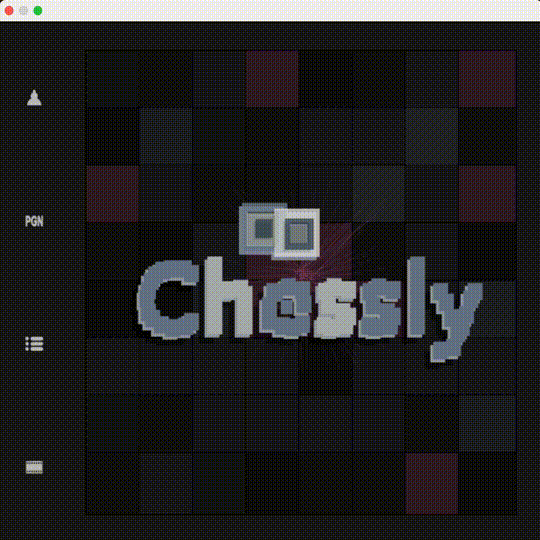

# chessly

The game of Chess in python



## Installation

You can use one of the following two options

### Installing by cloning the source code

```bash
git clone git@github.com:/alok1974/chessly.git
cd chessly
pip install .
```

### or

### Installing directly from github repo using pip

```bash
python -m pip install git+https://git@github.com/alok1974/chessly.git@master#egg=chessly
```

## Running

```bash
chessly
```

Enjoy!
